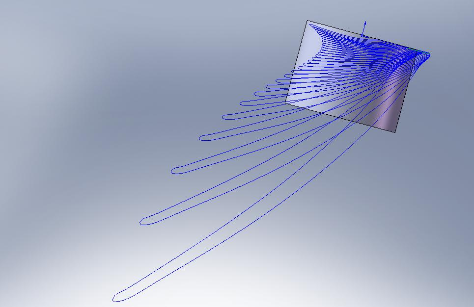

# HydroTurbineBlade
### Project using NREL HARP to design hydrodynamic turbine blade for floating river energy generation.

This project designed hydrodynamic turbine blades for use in a floating platform on the Thames as part of the [Active Energy project](https://cspace.org.uk/category/cspace-projects/active-energy/) and with grateful assistance from the [Tamesis Dock](https://www.tdock.co.uk/).
This generator was a moored floating platform designed to extract energy from flowing water from a turbine lowered into the flow of water which turned a 1kW generator (a repurposed electric bicycle motor hub) via a long propshaft. 
This arrangement is similar to a boat with an inboard motor, but operating in reverse. Instead of a propellor moving a boat through water, the movement of water relative to a fixed floating platform generates power. 

#### HARP_Opt

The [National Renewable Energy Laboratory](https://www.nrel.gov/wind/) is a national laboratory of the U.S. Department of Energy, Office of Energy Efficiency and Renewable Energy, operated by the Alliance for Sustainable Energy LLC. 
NREL regularly publishes leading research, data, and models in the field of renewable energy, the basis of the hydrodynamic turbine blade design is taken from the HARP_Opt model used to determine an optimal blade configuration from multiple parameters using genetic algorithm optimisation.
From the NREL [presentation](./docs/WT_Perf_Users-guide.pdf),

 > "The HARP_Opt (Horizontal Axis Rotor Performance Optimization) code utilizes a multiple objective genetic algorithm and blade-element momentum (BEM) theory flow model to design horizontal-axis wind and hydrokinetic turbine rotors.
Genetic algorithms solve optimization problems by mimicking the principles of biological evolution. Using rules modeled on biological reproduction and gene modification, genetic algorithms repeatedly modify a population of individuals to create subsequent generations of
"superior" individuals. HARP_Opt utilizes the MATLAB Genetic Algorithm solver to perform this optimization, and the WT_Perf BEM theory code to predict rotor performance metrics."

NREL [HARP_Opt](https://github.com/NREL/HARP_Opt) code was ported to run under [Scilab](https://www.scilab.org/)[^1] rather than the Matlab[^2] original code, 
allowing the use of FLOSS environments.

As the Thames is regularly filled with weed and debris, the blades were curved to allow debris caught on the leading edge to slide off. 
This design is taken from the mixing blades used in slurry tanks. 
A Clothoid spline curve creates a uniform tangential force on any particle trapped on the blade leading edge, this curve is also used in transport engineering so that motorists or train passengers are not subjected to uncomfortable forces transiting in and out of corners. 
The eventual design resorted to a log spiral curve for simplicity.

As there are no generator controllers used in this design, the blades are designed to stall at the upper limit of their designed power output. 
At the proposed location on the Thames, near Lambeth bridge, the river is tidal and flow is regularly reversed, so an airfoil section suited to low-flow, 
low Reynolds number regimens, the Bergey BW3 was selected based on windtunnel tests described in [Selig et al](https://m-selig.ae.illinois.edu/uiuc_lsat/Low-Speed-Airfoil-Data-V3.pdf)[^3], 
[Airfoil Data file](./XFOIL/Low-speed_Airfoil_Data_Vol3_Selig_et_al.zip) in XFOIL folder

MIT [XFOIL](https://web.mit.edu/drela/Public/web/xfoil/) was used to generate lift and drag coefficients for the airfoil over various angles of attack.

### HARP Optimisation

This data is prepared for use in AeroDyn using the [`AirfoilPrep_v2.02.01.xls`](HARP/Input_Files/AirfoilPrep_v2.02.01.xls) worksheet, airfoil input data is collated within [`Airfoil_Data`](./HARP/Input_Files/Airfoil_Data) directory.

Blade design optimisation for the BW3 airfoil instance is recorded in the Output_Files as [1W5_BW3_1m](./HARP/Output_Files/1W5_BW3_1m). Earlier design runs employing several competing GA models are not shown for reasons of brevity. 
This optimisation is further adapted to incorporating a hub in Output_Files as 1W5_BW3_1m_hub
HARP parameters settings recorded in [`1W5_BW3_1m_GRP3_Input.bmp`](HARP/Output_Files/1W5_BW3_1m_GRP3/1W5_BW3_1m_GRP3_Input.bmp), [`1W5_BW3_1m_hub_Input.bmp`](./HARP/Output_Files/1W5_BW3_1m_hub/1W5_BW3_1m_hub_Input.bmp) respectively.

The original MATLAB files in [`Source_Code`](./HARP/Source_Code) were ported to Scilab using [`mfile2sci()`](https://help.scilab.org/docs/2024.1.0/en_US/mfile2sci.html) to allow exploration of the code without requiring a MATLAB license (SCI_migrate)
The original HARP_Opt suppies a compiled Matlab executable, which functions with a runtime installer (not included for reasons of size, see HARP repository)
The ported version is in [`HARP2SWKS/SCI_migrate`](./HARP/HARP2SWKS/SCI_migrate)

[`createBladeSkeletonN.sce`](./HARP/HARP2SWKS/createBladeSkeletonN.sce) is a script that extracts the output values of the blade element scale, radial displcement and orientation from the HARP_Opt worksheet.
This script then creates interpolated airfoil sections and arranges them along the leading edge curve.
The dimensions for a hub are also added to the model as arcs which serve as guides for SolidWorks[^4] shape creation.
These airfoil profiles and edges are exported as Solidworks drawings in [`SWKScoords`](./HARP/Output_Files/1W5_BW3_1m_hub/SWKScoords).
The profile data is used to assemble a lofted surface within Solidworks CAD software, finally this model is divided up to into sections which make up a 2-part mould for shaping the surfaces from glassfibre.
bladedesign.xls spreadsheet allows calculation of thickness of blade faces and calculation of the dimensions of a balsa core.
[`bladedesign.xls`](./SWKS_hydrofoil/bladedesign.xls) spreadsheet allows calculation of thickness of blade faces and calculation of the dimensions of a balsa core.

### Epilogue
A floating platform using this hydrofoil was built, there were a short few hours where the platform could be fully assembled on the Thames foreshore before the tide would rise again and flow in the river would reverse.  
The platform was designed to pivot to allow the turbine to face into the flow direction, unfortunately we could not get the platform assembled and pivoting before the tide started to rush back.  
The platform rose in the tidal current and embedded the turbine blades in the river foreshore. Sadly, this was the last we saw of it. 

[^1]: https://www.scilab.org/legal-notice
[^2]: https://www.mathworks.com/matlabcentral/content/terms-of-use.html#general
[^3]: Lyon, C.A., Broeren, A.P., Giguere, P., Gopalarathnam, A. and Selig, M.S., 1997. Summary of Low Speed Airfoil Data: Volume 3.
[^4]: SOLIDWORKS 2024 is © 1995 - 2024 Dassault Systemes SolidWorks Corp.

### Gallery

|  |  |
|----------------------------------------------------------------------------------------------------------------|------------------------------------------------------------------------------------|
|                                                       |                        |
|                                      |                                                                             |
|                                                          |              |
|                                             |                                                     |

## References

Buckland, H., Masters, I., Chapman, J. and Orme, J., 2010, April. Blade Element Momentum Theory in Modelling Tidal Stream Turbines. In Proceedings of the 18th UK Conference on Computational Mechanics, Southampton, UK (pp. 8-10).

Sale, D., Jonkman, J. and Musial, W., 2009. Hydrodynamic optimization method and design code for stall-regulated hydrokinetic turbine rotors (No. NREL/CP-500-45021). National Renewable Energy Lab.(NREL), Golden, CO (United States).

Batten, W.M.J., Bahaj, A.S., Molland, A.F. and Chaplin, J.R., 2006. Hydrodynamics of marine current turbines. Renewable energy, 31(2), pp.249-256.

Lyon, C.A., Broeren, A.P., Giguere, P., Gopalarathnam, A. and Selig, M.S., 1997. Summary of Low Speed Airfoil Data: Volume 3.

Ingram, G., 2011. Wind turbine blade analysis using the blade element momentum method. version 1.1. Durham University, Durham, (2011).

